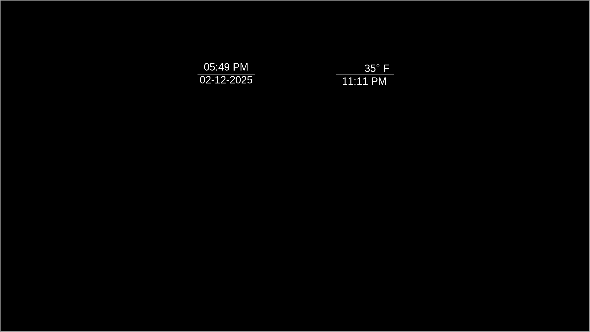

# Welcome!

Its like a mirror but smarter! This project is meant for those who want to build their own smart mirror from near scratch. The mirror works by creating widgets and then placing them on the mirror. Coded using python and tkiner the project it meant to be hacked on more than just configured. Although if done correctly each widget will generate its own config file.

You are supposed to be looking at a mostly blank screen! The project it supposed to run on something like a rasberry pi (or im using my highschool chromebook) and you run the program in full screen and place the monitor behind two way glass. I was heavily inspired by these videos:

- [DIY Smart Mirror](https://www.youtube.com/watch?v=OYlloiaBINo)
- [ALEXA Smart Mirror](https://www.youtube.com/watch?v=aa3VVZA0e5Y)
- [HOW TO BUILD A SMART MIRROR](https://www.youtube.com/watch?v=aa3VVZA0e5Y)

## Features
- multi threaded - each widget uses its own thread
- customizeable - use the widget template to create whatever you want
- configurable - each widget (if using template) will automatically create its own config file for you to tweak parameters

## Base Widgets
- Time - uses system clock to tell the time and date
- Weather - uses open weather map api to display temperature and time of sunset

## widgets TODO
- [ ] email integration
- [ ] todolist integration
- [ ] fun quotes
- [ ] home assistant integration
